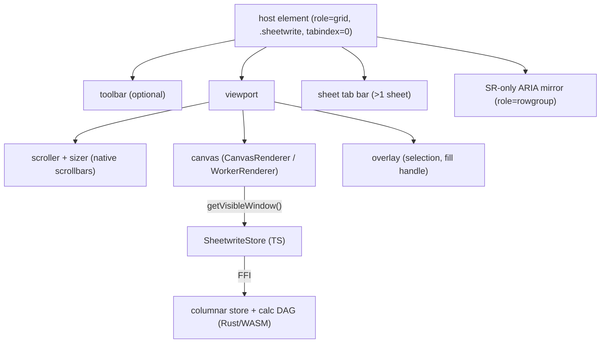

# Concepts

[Docs index](./README.md)

## Architecture at a glance

Sheetwrite splits cleanly into a **data engine** (Rust → WASM) and a **renderer**
(canvas). The TypeScript core (`@sheetwrite/core`) owns the host DOM, the
scroll/virtualization math, interactions, and the bridge between the two.



The renderer never holds cell data. Every frame it asks the store for one
rectangular window of resolved values and paints from that.

## Canvas rendering + the WASM columnar store

Cells live in the WASM module as typed columns, not as objects. Each cell has a
kind — `EMPTY=0`, `NUMBER=1`, `STRING=2`, `FORMULA=4` — and numeric/string data is
held in parallel typed arrays. This keeps memory flat and lets the store hand the
renderer a transferable, typed-array-backed snapshot.

Because the engine is columnar and WASM-resident:

- A sheet of 100k+ rows costs no DOM nodes and no per-cell JS objects.
- The render hot path is a single bulk read, not N cell lookups.
- The same snapshot can be transferred to a worker for off-thread painting (see
  [Worker rendering](./worker-rendering.md)).

## Virtualization & scaled scroll

Only the rows intersecting the viewport are ever painted. `computeWindow` turns the
current scroll offset and viewport height into a half-open row range
`[start, end)`, padded by `overscan` rows on each side so a fast scroll reveals
already-painted rows:

```ts
computeWindow(index, contentTop, viewportHeight, overscan): { start: number; end: number }
```

Row positions come from an `OffsetIndex` — a Fenwick (binary-indexed) tree over
row heights giving `O(log n)` scrollTop ↔ row mapping and `O(log n)` single-row
height edits, so variable row heights stay cheap.

Browsers cap an element's height at roughly 33 million pixels. At the default 28px
row height that is only ~1.2M rows, so for taller content Sheetwrite does **not**
size the scroll sizer to the true content height. `ScaledScroll` pins the DOM
sizer to the cap (`MAX_ELEMENT_HEIGHT = 33_000_000`) and maps the capped scrollbar
position linearly onto the real virtual range:

```ts
// DOM scrollTop -> content-space offset (identity below the cap)
toContent(scrollTop): number
// content-space offset -> DOM scrollTop
toScroll(contentOffset): number
```

Below the cap the mapping is the identity; above it, scrolling stays smooth while
the few-pixel-per-row resolution loss is invisible at that scale.

## The Store contract

A grid talks to its data through the `Store` interface. The two reads are
deliberately different:

| Method | Use |
| --- | --- |
| `getVisibleWindow(sheet, rows, cols)` | The **render hot path**. Returns one `VisibleWindowView` for a whole rectangle. The renderer paints from this and must never read cell-by-cell. |
| `getCell(addr)` | A **single-cell** read for interactions, API reads, and tests — never per frame. Returns `{ resolved, style }`. |

`VisibleWindowView` is backed by typed arrays (`values`, `styleIds: Uint32Array`,
a shared `styles` dictionary) so it is worker-transferable, and it is valid only
until the next store mutation or window refresh.

The full interface:

```ts
interface Store {
  getWorkbook(): Workbook;
  getCell(addr: CellAddress): ResolvedCell;
  getVisibleWindow(sheet, rows: { start; end }, cols: readonly number[]): VisibleWindowView;
  applyTransaction(tx: Transaction): ApplyTransactionResult; // queued, flushed at a barrier, never reentrant
  on("change", fn): () => void;                              // returns an unsubscribe
  getDirty(): DocumentOp[];                                  // pending unsynced edits
  markClean(patches: DocumentOp[]): void;                     // clear dirty flags after the API confirms
}
```

`getDirty` / `markClean` exist so you can sync edits to a backend and then mark
them confirmed.

## Document protocol and storage transactions

`WorkbookSnapshot` is the versioned, JSON-safe authoritative document. Schema 1
contains sheet order and identity, stable column keys, literal/formula/reference
cell inputs, sparse styles and row metadata, merges, frozen panes, conditional
formats, row groups, hidden document metadata, and named-range extension points.
Formula source is authoritative; resolved values are derived caches and are not
serialized.

`DocumentOp` is the exhaustive plain-data mutation vocabulary for that document,
and `Patch` is its backwards-compatible transaction name. Cells, ranges,
rows/columns, merges, row metadata, frozen panes, conditional formats, row
groups, named ranges, and sheet add/remove/rename/reorder operations all pass
through the same reducer, change event, dirty state, and grid undo/redo history.

```ts
const checked = validateWorkbookSnapshot(JSON.parse(payload));
if (!checked.ok) throw new Error(checked.errors[0]?.message);

const outcome = grid.store.applyTransaction({
  patches: [
    {
      op: "set",
      addr,
      value: { kind: "literal", value: "authoritative input" },
      style: { backgroundColor: "#fde68a" },
    },
  ],
});
```

Document state does **not** include selection, scroll position, editor/caret
state, search results, temporary highlights, renderer choice, read-only policy,
or local zoom. Those are session state. `Workbook.activeSheet` remains document
metadata in schema 1.

Applied storage transactions emit `change` with the filtered transaction,
per-cell rollback data, accumulated dirty patches, and epoch. Conflicts and
no-ops return explicit outcomes rather than throwing.

Sheet IDs remain stable across rename and reorder. Renaming rewrites canonical
cross-sheet formula source while preserving the stable formula-engine handle.
Removing a referenced sheet rewrites dependents to `#REF!`; undo restores the
sheet snapshot, formulas, styles, metadata, and dependencies. Removing the active
sheet selects the nearest surviving sheet. The final sheet cannot be removed.
All public document actions, including custom calls through `grid.actions`, are
no-ops when the grid is read-only.

### Cell values

A cell value is one of three shapes:

```ts
type CellValue =
  | { kind: "literal"; value: string | number | null }
  | { kind: "ref"; target: CellAddress }   // a plain cross-reference
  | { kind: "formula"; src: string };      // an "=" formula (see Formulas)
```

## Headers: letters vs. field names

The grid chrome is a real spreadsheet: the top band shows **column letters**
(A, B, C, … AA) centered, and the left gutter shows **row numbers** (its width is
`theme.rowHeaderWidth`; set it to `0` to hide the gutter). These letters are the
column headers the renderer draws — the `header` you set on a `Column` is metadata
(it is what CSV/XLSX export writes), not the on-canvas header.

Named **field** titles are therefore not chrome. The convention, exactly as in a
real sheet, is to put them in **row 0** (the first data row) and style them
yourself. The vanilla example (`examples/site`, `/vanilla`) reserves row 0 and writes a styled header band over
it once the initial page loads:

```ts
const FIELD_HEADERS = ["ID", "Date", "Customer", "City", "Amount"];

function applyFieldHeader(): void {
  grid.store.applyTransaction({
    patches: FIELD_HEADERS.map((label, col) => ({
      op: "set",
      addr: { sheet: "sales", row: 0, col },
      value: { kind: "literal", value: label },
      style: { bold: true, align: "center", backgroundColor: "#eef1f5" },
    })),
  });
}
```

Datasource pages can carry the same authoritative `CellValue` shapes as eager
data, plus `{ value, style }` wrappers. Formula sources, references, and styles
hydrate without entering dirty history. If row 0 is styled locally while a
page is outstanding, the local edit wins over that stale response; reserving an
empty row 0 in the source remains useful when the source itself should never
provide a title row.

## See also

- [Configuration](./configuration.md) for the option and method reference.
- [Data operations](./data-operations.md) for sort/filter views built on the same window read.
